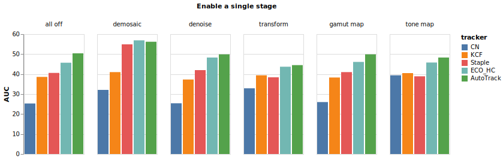
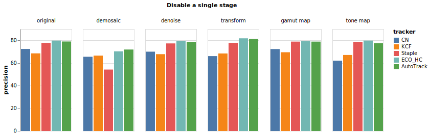

# Experiment Results

## 1. Enable a single stage in ISP

## 2. Disable a single stage in ISP

## 3. Minimal ISP with demosaic and gamma compression stages

## 4. Demosaic v.s. Subsample

## 5. Bit-numbers

